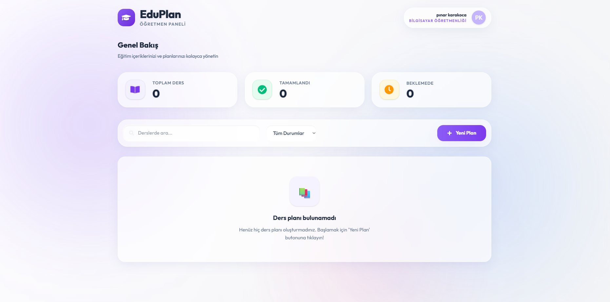

# 📚 EduPlan – Web Geliştirme Projesi

EduPlan, web geliştirme eğitimi kapsamında öğrenilen modern teknolojiler kullanılarak geliştirilmiş bir ders planlama uygulamasıdır.  
Bu uygulama, öğretmenlerin ders planlarını oluşturmasını, düzenlemesini ve yönetmesini sağlar.

---

## 🎯 Projenin Amacı

Bu proje ile;

- HTML, CSS ve JavaScript temellerini pekiştirmek  
- Modern JavaScript kütüphaneleri (React) kullanmak  
- Gerçek bir frontend projesi geliştirmek  
- Öğrenilen kavramları bütüncül şekilde uygulamak  

amaçlanmıştır.

---

## 🛠️ Kullanılan Teknolojiler

- ReactJS  
- TypeScript  
- Vite  
- React Router DOM  
- Tailwind CSS  

---

## 📁 Proje Yapısı
src/
├── components/
├── pages/
├── interfaces/


---

## ⚙️ Uygulanan İşlemler (CRUD)

Proje kapsamında aşağıdaki işlemler gerçekleştirilmiştir:

- ➕ **Ekleme (Create):** Yeni ders planı oluşturma  
- 📋 **Listeleme (Read):** Ders planlarını görüntüleme  
- ✏️ **Güncelleme (Update):** Mevcut ders planlarını düzenleme  
- ❌ **Silme (Delete):** Ders planlarını silme  

---

## 🖼️ Ekran Görüntüsü



---

## 🚀 Kurulum ve Çalıştırma

Projeyi çalıştırmak için aşağıdaki adımları takip ediniz:

```bash
git clone https://github.com/bnrilla/EduPlan.git
cd EduPlan
npm install
npm run dev
